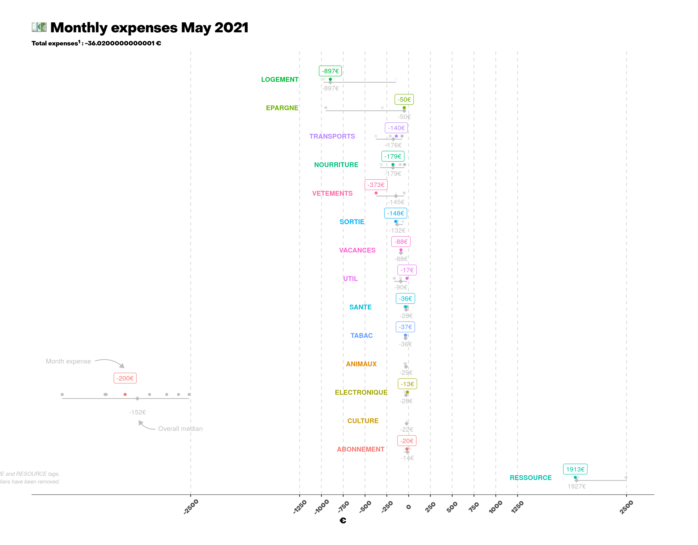

# :euro: Personal Finance Analytics

Analyse personal finance through ggplot graphics.

Using [Notion](https://www.notion.so/product) to log spendings and its new API, it schedule monthly email report and reminder through GitHub Action.

[Checkout the blog post behind this project !](https://medium.pimpaudben.fr)

